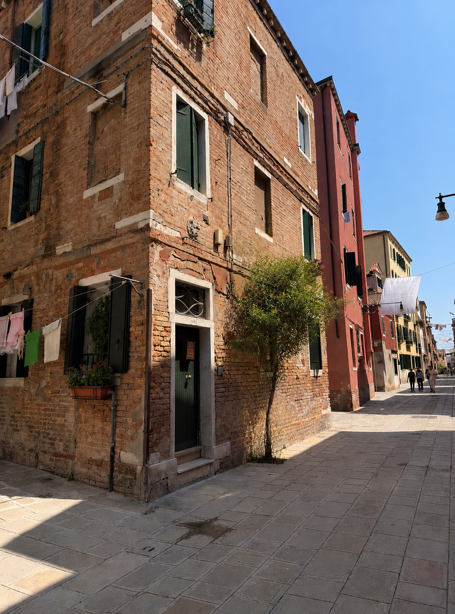
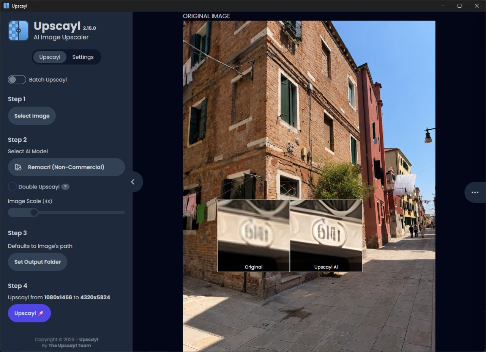
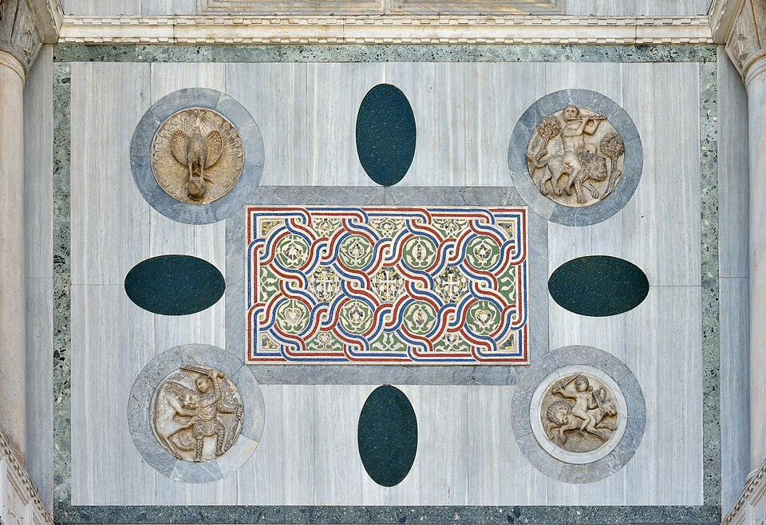
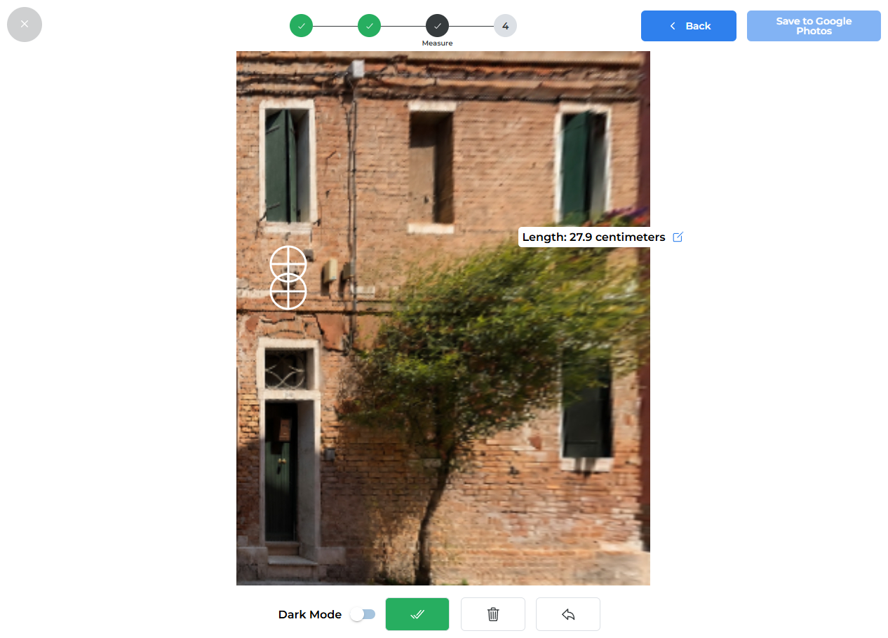
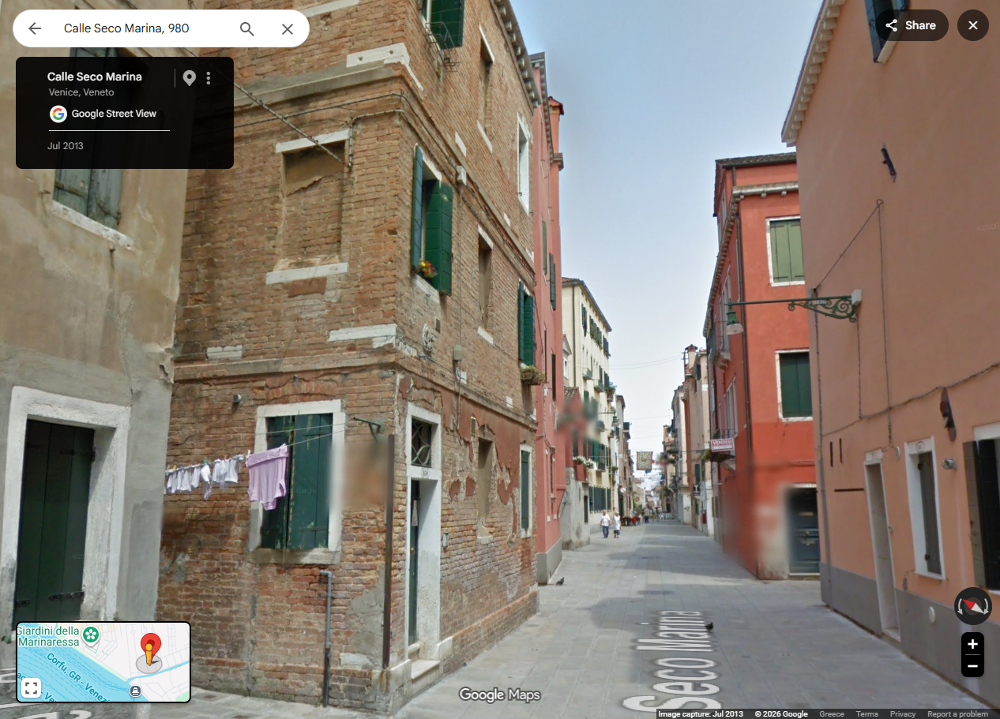

I’m a doctor and computer scientist, not an investigator, and nobody pays me to work out where a photo was taken. I do the [Bellingcat challenges](https://challenge.bellingcat.com/) because the reasoning behind them is the same reasoning I want kept sharp for the day job, and _Planted Evidence_ was the one this month (July 2026) that actually made me earn it.

The challenge hands you a photo of a narrow street, a few plain houses, and a tree growing up at the edge of the pavement. That tree is the catch: someone AI-edited it over the image, and in doing so mangled the number on the closest house.

So the one thing your eye reaches for first is deliberately gone. That’s the whole trap. Can I _still_ find the location?

# The challenge

The puzzle, like all this month, was created by [Gisela Pérez de Acha](https://www.instagram.com/gisela_perezdeacha/). The challenge description reads:

> `It’s becoming increasingly common for people to use AI to generate edited versions of images, but sometimes important details get lost.
> 
> Here, someone thought there should be some more greenery in this image, but the house number is totally destroyed.
> 
> Regardless, can you still geolocate it?
> 
> **What’s the name of this street (omit ‘street’, ‘road’, ‘calle’, etc)?**`

# The dead ends

My first search instinct was wrong, which is worth admitting because it ate the most time.

The street immediately read as Italian, or maybe Croatian or Spanish, and the colour of the sky made me think of somewhere relatively northern, or at least close to the sea. The exposed brickwork, colours, paved streets and the bricked-up windows, along with my own memory of the city, all pointed towards **Venice**, so I ran with that as my first assumption.

I zoomed into the photo and started looking around. The numbers were indeed completely garbled (although I _thought_ I could make some order out of the chaos) and there of course wasn’t any street sign to be found. I searched for shop signs, maybe some local sight at the far end of the street, or even any identifiable information on the people strolling by. Nothing; at least nothing _I_ could see. Maybe the drying sheet isn’t a sheet but a banner, faded from years of fluttering in the sun and wind? No, just a regular sheet.

Now, I try to avoid using AI or reverse image search for solving the challenges where I can, but I honestly hadn’t a clue. So, I fed the image into Google Lens, and I got my first positive: the street indeed seemed to be in Venice. The related images definitely confirmed that for me, as the similarities were undeniable. However, other than that, Google Lens got me nothing. I fed it façades, the view down the street, the overall composition, and nothing but noise ever came back. Yandex image search wasn’t at all better. All I ever got were lots of hotel suggestions that I checked and dismissed as solutions (and which will certainly be showing up in my ads for the next week). My guess is the AI artefacts were **poisoning** the match on top of the ordinary difficulty of a plain Venetian alley.

Then I did the thing you’re not supposed to do: I spent _far too long_ trying to rescue the number. Upscaling, squinting, hoping. The amazing app [Upscayl](https://upscayl.org/) unwittingly fed my delusions as it managed to produce an artificial scribble resembling a “6” at the start of the number. That led to me spending way too much time trying different combinations in Google Maps, unwilling to admit the number was gone, and it was gone on purpose.

The one other thread the reverse image search had given me: the street was probably in the less touristy _sestieri_ of Venice, either **Castello** or **Cannaregio**. However, no amount of further searching revealed anything useful, not even a trace. Eventually I gave up and went back to shoving the Street View pegman around. Google’s coverage of these unglamorous eastern neighbourhoods is grim, shot back around 2013 and washed out to hell, but those Venetian streets are still striking. The same cannot be said for my blind searching, the equivalent of stirring an empty pot and waiting for dinner.

As my resolve was further breaking down, I hung onto the only thing I believed at the time was identifiable enough: the red building. Sadly, “hanging on” in this case meant going into Globe View and searching for any building with that memorable deep-red colour. I wouldn’t really suggest this method to anyone with an instinct to preserve their sanity.

# The break

The thing I’d been looking straight past was the carving set into the wall above the door. In Venice these are called **_patere_**.

A word on what that is, because it turned out to be the whole game. A _patera_ is a carved stone roundel set into the façade of a Venetian building. According to the [_Discovering Patere_ Project website](https://patere.altervista.org/what-is-a-patera/), _patere_ are “[…] Veneto-Byzantine circular bas-reliefs on the facades of the most antique venetian palaces and also in church architectures, like the Basilica di San Marco.” Most _patere_ date from the end of the 12th to the 13th century, and they most commonly show animals or birds, like lions, peacocks, and griffons, often facing or devouring each other. They were possibly part ornament, part ward against bad luck.

The part that matters here is that Venice is documented to an **incredible** degree, and people have even gone around and inventoried these carvings by address. Honestly, this is what made the whole challenge doable in the first place, and it’s exactly the sort of attention to easy-to-miss details these challenges in general are built to reward. It reminds me of how much beautiful work is done by people all over who spend hours and hours collecting and disseminating information about this world we inhabit, and whose labour fuels so much progress in OSINT and beyond.

# Running it down

So I cropped the _patera_ out and looked at it properly. It’s worn, but it reads as a single figure rather than a symmetric pair, something hunched over a smaller animal, a predator on prey. That alone rules out the huge number of “two facing birds” motifs that fill the catalogue; but I wasn’t confident enough in my read of the carving to base my investigation on that.

Fortunately I quickly found something better: a spreadsheet! And specifically, [this amazingly detailed](https://drive.google.com/file/d/1JrFxDtXFqrW8g5wlia1YY_nwDoxptxKf/view) open data spreadsheet by [veniceprojectcenter.org](https://veniceprojectcenter.org/opendata/38d62efd-22c4-47ec-8b60-f65d54b6927a).

I was dumbfounded by the number of _patere_ and the depth of documentation — 494 _patere_, with descriptions of the patterns, the materials, even the surrounding area!

I made a copy and got to reducing the list. I filtered for a purely residential area (with commercial, tourist, and church set to false), in the _sestiere_ of Castello or Cannaregio, and not on a canal. Just those 6 filters dropped the number to 61. I thought that even if I couldn’t narrow it down enough to check manually, I could use the smaller list and my approximate impression of the relief to get an AI to go through what remained.

I imported the image into an [app](https://imagemeasurement.online/) that helps you calculate distances in a photo based on perspective and a known measurement, using the wiring box on the wall (which I guessed would be around 20cm tall) to estimate the diameter of the _patera_. I knew that my measurements wouldn’t be very accurate, and seeing the calculated diameter of 27.9cm, I set a filter for the diameter to be less than 35cm for a safety margin. This brought the total down to 39. I didn’t use the height as a factor, as too many rows were blank, and the measurement error would also be greater.

Finally, I decided to add a filter for the condition, removing any _patera_ not in fair or good condition. New total: 29.

Checking the very first row in the new table, I saw the listed subject: “gryphon above hare/rabbit.” Predator on prey. The address was Calle Seco Marina, house number 980 (by the way, did you know Venetian house numbers run per _sestiere_ and not per street?) in the working-class east of Castello. I went into Google Maps.

It was much more low-saturation than this city deserves, but it was unmistakably the same corner looking at me through Street View: the bricked-up windows, the shutters, the carving still up on the wall. The challenge was over.

# The answer

**Seco Marina.** (The challenge wants the name without the generic prefix, so that’s what goes in the box.)

# Why I bother writing these up

This is the one that captures why these challenges are worth the evenings. The edit destroyed the obvious clue and left the answer sitting in a detail too incidental for the forger to bother touching. That habit generalises well past OSINT: when the clue everyone reaches for is gone or can’t be trusted, the signal is usually hiding in whatever nobody thought was worth faking. I spend my working days on a version of the same problem, reading a case where the loudest finding is a red herring and the actual answer is in some boring line halfway down the chart. Same muscle. The whole point of this month’s set was to stop taking images at face value, and this was the challenge that drove it home hardest.

<!--
CHECKLIST before you flip draft to false:
  - filename = the URL slug. Short, hyphenated, permanent-ish.
  - title/description written for a search result, not placeholders.
  - category is one of: osint | policy | tutorial | note
  - pubDate is right
  - DOUBLE quotes around title/description (apostrophes break single quotes)
  - images self-hosted in src/assets/ (external ones are CSP-blocked)
-->