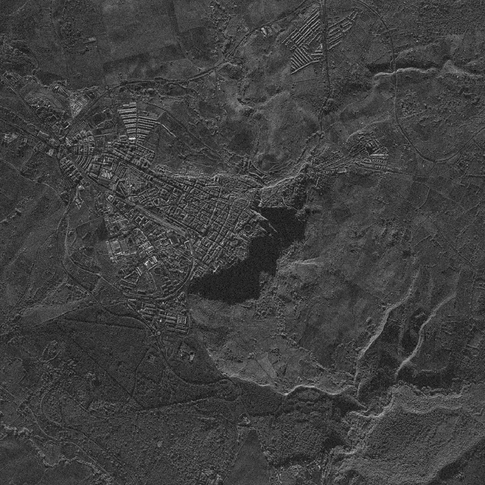
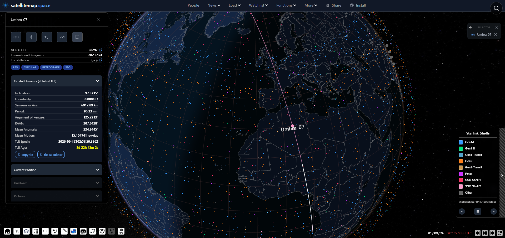
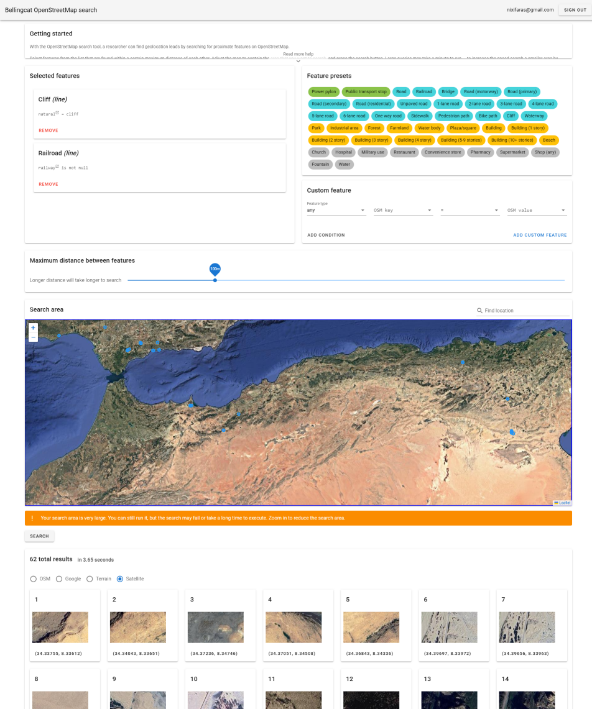
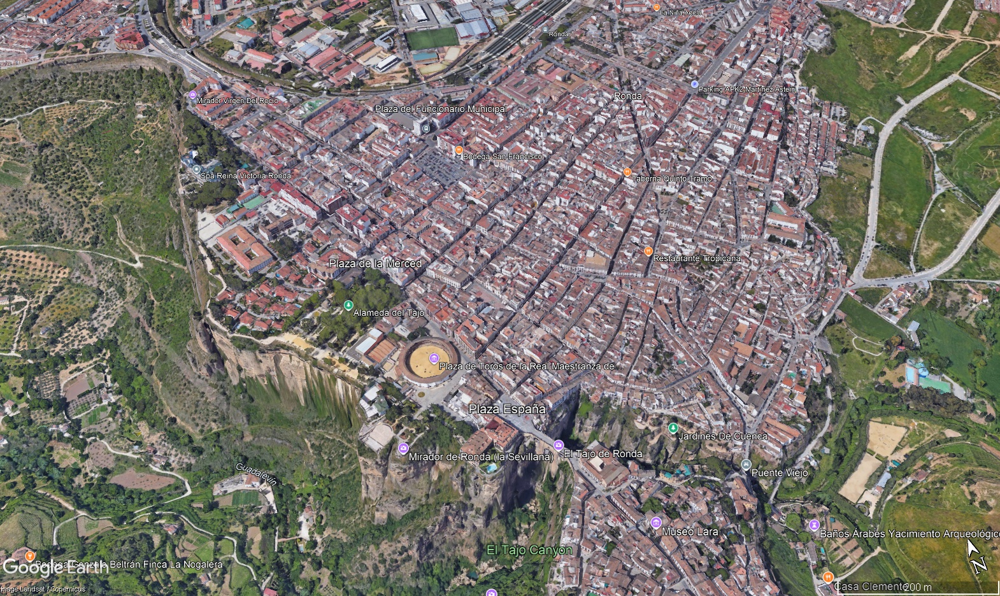
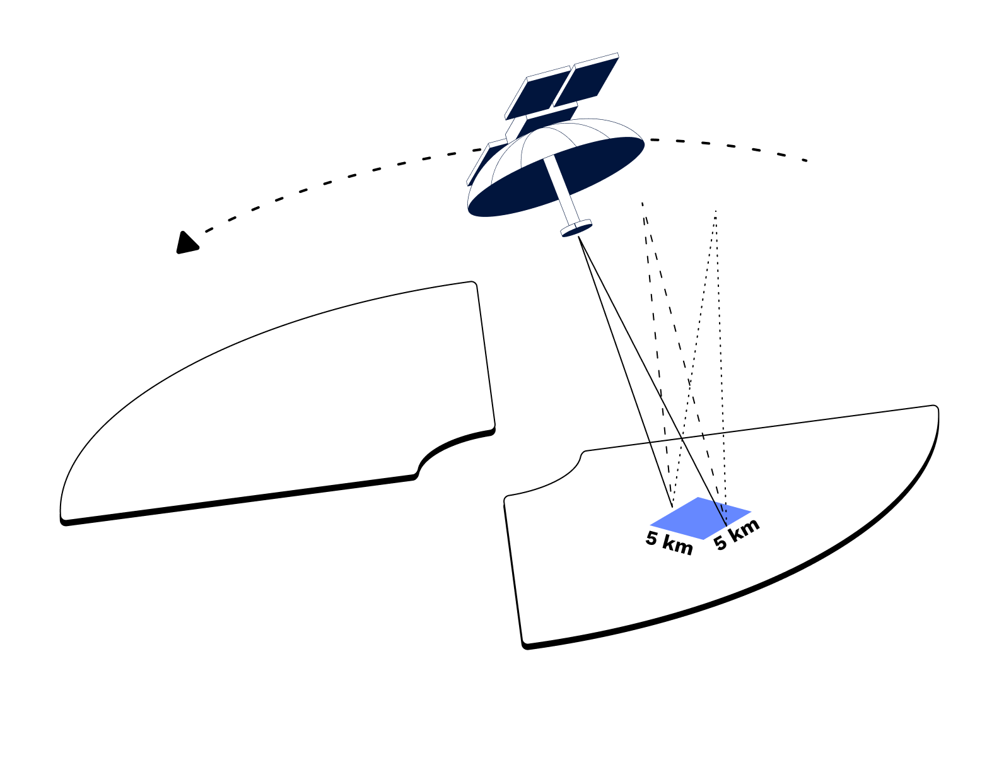

import Sidenote from '../../components/Sidenote.astro';

I'm a doctor and computer scientist, and solving Bellingcat Open Source Challenges is one of my favourite hobbies, because the reasoning and research skills you need to apply to solve them are the same ones I want kept sharp for the day job. *Shadow Play* was this month's standout for me, and it was the first one where I had to learn an entire imaging modality from scratch before I could even read the picture.

The challenge gives you a grainy greyscale image of a town and asks you to locate it. Turns out, the road to that revelation isn't that straightforward (to me, at least).

# The challenge

The challenge was created by [Jake Godin of Bellingcat](https://www.bellingcat.com/author/jakegodin/) and the description itself reads:

> Interpreting SAR images can be difficult, particularly when sudden changes in elevation obscure parts of the landscape.
>
> **What is the name of the city visible in this SAR image?**

# Learning to read the image at all

Before this I had seen [synthetic aperture radar](https://en.wikipedia.org/wiki/Synthetic-aperture_radar) (SAR) maybe three times, all of it Venus or impressive volcano flanks. So the first half hour went on reading about how it works, which I found fascinating. Even though the experience brought back memories of the horror of deciphering CT scans for the first time during med school, it was ultimately essential reading – much like radiology, one might say.

The thing to internalise is that brightness in SAR has nothing to do with colour or light. A radar measures how much energy bounced back, so brightness is geometry and roughness. A vertical wall meeting flat ground makes a corner reflector and comes back bright, which is why towns glow. Smooth surfaces like water and asphalt reflect the energy away from the sensor and come back dark. And terrain the beam physically cannot reach comes back black, because it is shadow.

Armed with that, the big dark wedge in the image was obviously a shadow thrown by a sudden drop. However, even after the reading, at first I couldn't work out which side the radar had been looking from, which would play a role in the process.

What I _could_ read were the **rail lines** running into the town and the station sitting in the middle of it, and a **street layout** that felt European to me, or possibly a town of colonial origin, which from above often look much the same. And one circular ring-shaped building that I could not place at all.

# The dead ends

I decided to work backwards from the provider. It was obvious from my initial reading and a few Google searches that purely open SAR data does not usually come at resolution this fine; so this had to be commercial imagery, and there are only a handful of those.

**Umbra** was the first one I looked at, but I quickly abandoned it; its [open data archive](https://registry.opendata.aws/umbra-open-data/) was not structured in a way that helped me, and most of what I could see was over the Americas. I was not going to trawl an untagged archive by hand, so I moved on to **[Capella](https://registry.opendata.aws/capella_opendata/)** and **[ICEYE](https://www.iceye.com/open-data-initiative)**, which are better organised and have thumbnail galleries. I scrolled through all of those and nothing matched. 

At that point, after looking at a few hundred images, I was back at square one with nothing but a grey picture and blurry vision.

Then I noticed something **I should have noticed** at the start: the file had a very specific name. `2026-09-01-20-39-49_UMBRA-07`. A timestamp, and a satellite: a single search told me UMBRA-07 is one of Umbra's little birds (shocking discovery, I know).

That turned a vague hunch into a specific question, so I went looking for a better way to search Umbra's archive than scrolling a web directory. Bellingcat have actually published an [Umbra open data tracker](https://github.com/bellingcat/umbra-open-data-tracker) for exactly this, and you can load it straight into Google Earth Pro and see the coverage laid out on the globe. I did, but the useful thing it told me was negative: the open data simply **does not extend** to the date in the filename. Whatever this image was, it had never been released for free, and no amount of browsing the public catalogue was going to surface it; instead, I would have to work for it.

So I went orbital. I opened up [staellitemap.space](https://satellitemap.space/) and tried running the clock back to put the satellite where it was at that exact second. I have to say, while the site's interface and graphics are lovely, scrubbing back to a past timestamp is genuinely painful (or at least _I_ couldn't figure out how to do that *and* keep focused on a specific satellite). While I was waiting for the time-travel, I pulled the [two-line elements](https://en.wikipedia.org/wiki/Two-line_element_set) (TLEs) from [space-track.org](https://www.space-track.org) and used satellitemap.space's [TLE calculator](https://satellitemap.space/tle-calculator) to see where that put me. 

However, when I got there, I got a position over a random patch of Algeria with nothing underneath it. 

Of course, then I realised something I had never thought about: satellites like this do not photograph the ground directly beneath them. A side-looking radar never images its own ground track. Obvious in retrospect, since the picture is plainly not taken from straight overhead, but it had never crossed my mind before.

I wasn't really in the mood for more calculations, so even though I avoid using either AI or reverse image searches for these challenges, I handed the orbital data to Claude and had it work out where on the ground the satellite could plausibly have been pointing. It came back with an _annulus_, a ring of possible ground positions a few hundred kilometres out from the track, and a shortlist that sat firmly in North Africa. That _would_ track, since the region does have more than a few towns that can have layouts vaguely like this – French colonial towns, basically – but the list was ultimately wrong. As I only understood the real reason for that at the end, I will come back to it later as a genuinely good lesson. For now, I only had my instinct telling me the list wasn't where the answer would be found, so I didn't dig deeper into it.

# The break

I went back to the picture and to the one thing I had never explained: the **circular building**.

Could it be a football (soccer) stadium? I didn't think so. Stadiums are usually oval or rectangular rather than circular, and they are elaborate, with stands of different heights and a lot of structure. This was too smooth and too perfectly round for that. It also looked too clean and symmetrical to be a Roman ruin.

That left a bullring. And a bullring meant **Spain**, which matched the feeling I had had from the street layout all along, even though the orbital analysis was pointing me at Algeria and Tunisia. Hmm.

So I stopped trying to derive the location and started querying for it instead. Bellingcat's own [OSM search tool](https://osm-search.bellingcat.com/) lets you find places by combinations of nearby map features, so I set it to hunt for **railways** and **cliffs** within a hundred metres of each other, across Spain, Morocco, Algeria and Tunisia.

That returned a handful of results. I worked through the North African ones, got to Spain, and there was _Ronda_. 

The street layout matched. The railway matched. I flipped to satellite view to be certain, and there it was: the bullring, sitting right at the edge of the cliff. It is a remarkably stunning piece of townscape.

The joke at my expense is that a picture of that exact bullring above that exact cliff is one of the first things you get if you search for images of cliffside towns on Google. I just had no way of knowing that before I knew what I was looking at.

# The answer

**Ronda**, in Málaga province, Andalusia.

# The part where the satellite maths sent me to the wrong continent

I assumed the timestamp must be wrong. Off by a few minutes, or in some local time zone rather than UTC, because otherwise the geometry pointed at Algeria and the answer was in Spain. But I couldn't let it go, so I had Claude check whether UMBRA-07 could have seen Ronda _at all_ that day, by propagating the orbit across the full twenty-four hours and looking for moments when the satellite was in a position to image the town.

And of course, it could. There was a near-perfect pass, with the town almost exactly side-on to the satellite, at a range of about 780 kilometres and an angle of around 41 degrees. The time of that pass was **20:41:05 UTC**. The filename says 20:39:49, 76 seconds apart.

Which meant that most probably my _mental model_ of the SAR modality was wrong, not the timestamp. That was the moment when the reading I had done at the beginning really clicked together! 

I had been treating the image as an instantaneous snapshot, a shutter clicking, and asking where the satellite was pointing at that second. However, as I had read – in Umbra's own docs – but not yet fully internalised, that is _not_ how a spotlight collect works. The satellite **locks onto** a fixed point on the ground and keeps staring at it while it flies past, building up a synthetic aperture over the whole pass – hence the very name of the modality. The angle it is looking at sweeps continuously through the collect. At 20:39:49 the satellite was still approaching and looking well forward of itself; by 20:41:05 it had flown several hundred kilometres along its track and was looking straight out to the side at Ronda.

So the filename is almost certainly the moment the collect starts, or the moment the tasked job begins running, not the moment of some notional exposure. The geometry at that instant is the _start_ of a sweep, not the answer.

Now, that is very interesting as a realization on its own. It also – kind of – generalises: if you too, dear reader, want to backsolve such an image or capture from satellite data, don't treat the job itself as a single instant, but instead propagate a window of a couple minutes either side of the timestamp and see where the geometry leaves you and what lines up. 

That said, the most important "lesson" has to do with the methodology itself: never rely on any tool blindly, even when what it returns sounds convincing at the surface.<Sidenote>This is one more good reason to avoid AI tools in these challenges, too; they're hard enough without wrong leads</Sidenote> Everything on the shortlist Claude gave me scored well _precisely_ because it was being scored against the wrong second; Claude wasn't exactly wrong, but it wasn't correct either.

# A note on Umbra's public data, for anyone following the same path

Checked while writing this up, since the dead end above is worth documenting properly rather than leaving as "I couldn't find it."

Umbra's open data catalogue on S3 stops well short of this image's date. The STAC tree only contains directories for 2023, 2024 and 2025, and the 2025 catalogue lists months up to August. Ask it for anything later and you get a `NoSuchKey`. So the tracker was right, and the gap is real.

# Why I like writing these up

Three things I'm personally taking away from this one:

**Read the filename first**. The name of the file was, once again in these challenges, most of the solution, and I found it after I had already burned quite some time – and my retinas – scrolling through thumbnail galleries. Slow down before you speed up; we say "first things first"<Sidenote>That applies to more than filenames. Most image-based challenges won't be hiding the solution in the EXIF data, but checking it anyway won't hurt.</Sidenote> for a reason.

**There is far more data in a single image than the obvious.** This whole thing could have been solved without touching orbital mechanics at all, just by querying for railways next to cliffs all over Europe the moment I noticed both. That would have been potentially faster, considerably less interesting, and way more tedious. Plus, it wouldn't have taught me so much about satellites.

And, for a touch of seriousness, the one that maps directly on medical work and research: 

**A confident quantitative model built on a wrong assumption will produce a clean, precise, wrong answer, and it can out-argue your instinct while it does so.** The orbital analysis gave me numbers to two decimal places and pointed at the _wrong continent_, and the thing that saved the solve was a vague feeling about the streets and a circular building I could not explain. I spend my working days around calculated scores, risk models, and statistical results that do exactly the same thing. Sometimes the correct move is to trust the observation that will _not_ fit the model, and go find out why it will not fit.

Never forget, instinct is a powerful force. Sharpen it well enough and it will never let you down.